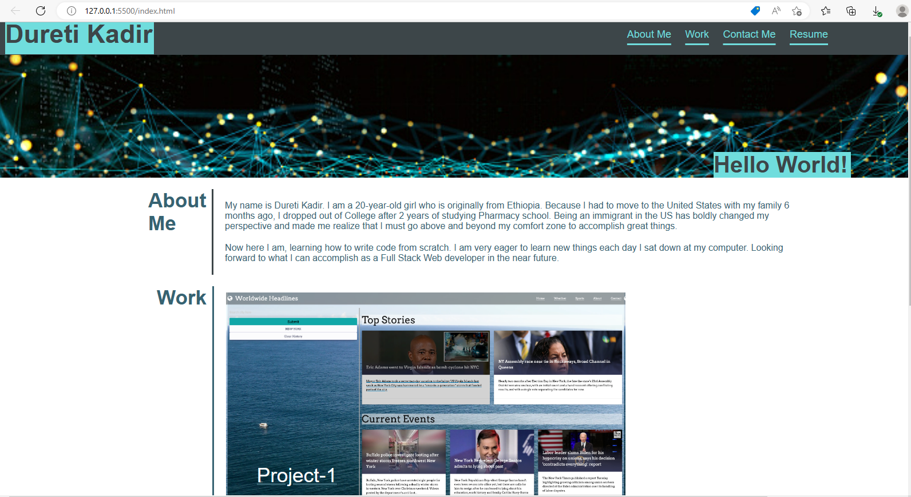

# Challenge2

## Advanced CSS Challenge: Professional Portfolio

## Description
This portfolio is done using HTML and CSS only. It consists of flexboxes and a glimpse of my story in the About me section. This page is not 100% responsive but some effort is put in to it to make it some how responsive and adaptoble to smaller viewports. When clicked on the first image in the work section it opens the first deployed application. 

## Screenshoots

 
---------

&copy;2022
